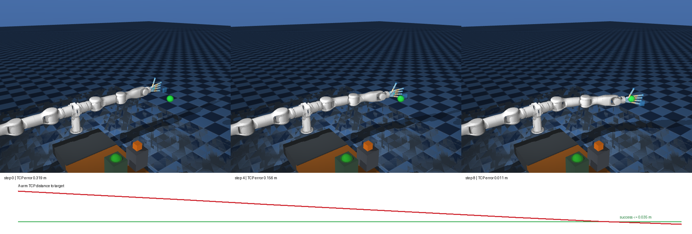

# A 臂 MuJoCo 首期任务与验证

## 任务和模型

首期任务是 **A 臂末端到达固定三维目标区域**。现有 `cooking_proj` 与厂商仿真文档均把左臂映射为 SDK `A`。任务使用 `left_joint1..7`、`act_left_joint1..7` 和 `left_palm_tcp_site`；控制动作是 7 维归一化关节增量，每步最多 `0.04 rad`，控制周期 `0.1 s`，成功条件为末端距离目标小于等于 `0.035 m`，最多 80 步。目标是模型在预设目标关节构型下前向运动学得到的 TCP 位置，因而在当前模型中可达。奖励在训练时为距离进度加成功奖励，评估以实际 TCP 距离判定。初始关节角加入 ±`0.03 rad` 扰动。末端目标为固定点，不涉及抓取、力控或视觉识别。

`cooking_proj/docs` 的资源清单引用 `cooking_proj/local/assets/robot_assets/mujoco/right_chopping_scene.xml`，同时需要 `MarvinCCS` STL 和灵巧手资源。这些资源没有纳入当前工作区的 `cooking_proj` Git 检出；本机另一份检出的完整资源曾用本项目 MuJoCo 成功加载。OMI 通过 `--scene` 使用外部路径，不复制第三方模型和网格。换机器时需重新提供该资源树。模型虽包含天机几何与动力学场景，**尚未证明与现场机器的安装、工具、负载和动力学参数一致**。

此外厂商 `TJ_FX_ROBOT_CONTRL_SDK/MUJOCO_SIM/README.md` 还描述单 A 臂 `marvin_m6.xml`，但它指向的 `marvin_mujoco/model/marvin_m6.xml` 不在本工作区，因此本轮使用实际可加载的双臂场景，控制其中的左 A 臂。该场景还含右臂、灵巧手、刀具和工作台；本任务仅发送左臂七个位置执行器的目标。旧的七关节零重力代理模型继续用于快速接口测试，不能代替这个场景的实验结论。

## 流程初始化和运行

以下命令从 `omi_proj/` 执行。`SCENE` 换成当前机器上的实际资源路径：

```bash
SCENE=/path/to/cooking_proj/local/assets/robot_assets/mujoco/right_chopping_scene.xml
uv venv .venv --python python3.12
uv pip install --python .venv/bin/python -e '.[dev,train,viz]'
.venv/bin/python -m omi_hil_rl.sim.preflight --scene "$SCENE"
```

预检会编译 MJCF，验证 A 臂关节、执行器、TCP 标记，输出关节限位、初始/目标 TCP 和控制周期。这里列出的限位仅是仿真模型参数，不能直接当作实机授权边界。

人工示范入口采用**终端键盘**，每次输入 `1+` 到 `7-` 并回车，使选定关节执行一个受限增量；空回车保持，`r` 复位，`q` 退出。人工请求与实际裁剪后的动作都记录在 JSONL 中。它是逐步式遥操作初始化，适合数据契约和安全边界验证；若现场需要连续、低延迟遥操作，应再接入手柄并测量延迟。

```bash
.venv/bin/python -m omi_hil_rl.sim.keyboard_teleop --scene "$SCENE" \
  --output data/demonstrations/keyboard.jsonl
.venv/bin/python -m omi_hil_rl.training.validate_recording data/demonstrations/keyboard.jsonl
```

训练入口使用 SB3 SAC、HIL 双源回放和示范行为克隆；脚本教师按概率接管，用于自动回归测试。它与键盘真人示范共用环境的动作仲裁和记录格式；训练脚本可用 `--demo-recording data/demonstrations/keyboard.jsonl` 预填真人示范，导入前验证格式、模型与观测范围。默认前一段全部由教师接管，之后部分接管。经验池存储最终执行动作，不把被覆盖的策略动作误标为执行动作。键盘示范质量由操作者负责，训练前应查看轨迹和成功标注。

```bash
.venv/bin/python -m omi_hil_rl.training.sim_train --scene "$SCENE" \
  --steps 1500 --demonstration-steps 500 \
  --later-intervention-probability 0.2 --evaluation-episodes 10 \
  --output-dir data/sim_runs/a_reach_seed0 --seed 0
.venv/bin/python -m omi_hil_rl.training.validate_recording \
  data/sim_runs/a_reach_seed0/transitions.jsonl
.venv/bin/python -m omi_hil_rl.training.sim_eval \
  data/sim_runs/a_reach_seed0/policy.zip --scene "$SCENE" --episodes 30 --seed 2000
```

如已有键盘示范，在训练命令中追加 `--demo-recording data/demonstrations/keyboard.jsonl`。使用脚本生成的 7 步示范做过导入回归：100 步短训练后的经验池为 107 条，其中 7 条来自文件。

生成独立评估可视化（绿色球为目标区域，红线为 TCP 距离）：

```bash
MUJOCO_GL=egl .venv/bin/python -m omi_hil_rl.sim.visualize --scene "$SCENE" \
  --checkpoint data/sim_runs/a_reach_seed0/policy.zip \
  --output-dir data/visualizations/a_reach_policy
```

无 GPU/EGL 的机器可以试用可用的 MuJoCo 离屏渲染后端。渲染结果同时保存 GIF、PNG 和 JSON 指标。本次策略结果已保存在仓库证据中：



[查看 GIF 动画](evidence/a_reach_policy.gif)

## 本次可重复验证结果

运行环境：本机 MuJoCo 离屏渲染、CPU 版 PyTorch、外部 `right_chopping_scene.xml`；控制器为上述脚本教师和 SAC 策略。1500 个训练步中有 709 个脚本接管步，逐步记录验证为 1500 条 transition、124 个结束回合。训练后 10 回合评估成功率 `10/10`，平均 `8.2` 步；另取种子 2000 起的 30 回合评估成功率 `30/30`，平均 `8.27` 步。GIF 展示的独立策略回合中，TCP 距离从 `0.319 m` 降至 `0.011 m`，8 步达到目标。

这些结果说明本任务的仿真、接管、经验记录、训练、评估和渲染闭环工作。该目标与初始状态固定且很简单，教师可快速完成；成功率不代表策略能处理物体、视觉变化、扰动，也不预测真机成功率。

## 迁移到真实 A 臂

1. 用现场 A 臂和安装方向核对 `left_joint1..7` 与 SDK A 的关节顺序、符号、零位、TCP 定义。当前 `left_palm_tcp_site` 对应灵巧手掌，不一定等于实机工具中心。
2. 使用已实现的 `TianjiSdkArm` 先只读连接，检查订阅帧递增、七关节反馈、控制状态和错误码。SDK 接口以度为单位；适配层统一转成弧度。现场必须填写经过确认的关节限位、单步限制、控制模式与急停路径。
3. 在设备旁人员和物理急停准备就绪后，分离地验收受限单步控制、反馈延迟、停止和复位。仿真控制周期 `0.1 s` 只是实验参数，不能直接用于实机。
4. 把真人遥操作、相机时间戳、成功标注、动作确认与异常事件并入同一 transition 契约。当前键盘端只在仿真使用；实机运动入口默认关闭，且未连接真机。
5. 实机上线前还需把仿真 SAC 训练循环与 LeRobot HIL-SERL 的 actor/learner 和经验池对齐，检查接管标记、延迟与采样比例；本轮并未完成分布式或真实在线 RL。
